# Raspbian Docker QEMU

This is a Docker container that allows you to run raspbian using QEMU user mode emulation. This can be used for a variety of purposes, such as using your own computer to build ARM binaries for the Raspberry Pi.



## Available Tags
All images are available on [DockerHub](https://hub.docker.com/r/choonkiatlee/raspbian)


choonkiatlee/raspbian:slim   => Minimal variant of Raspbian. Includes only Python3, git + minbase packages
choonkiatlee/raspbian:build  => Raspbian with build-essential and blas installed. This is meant for easily building python packages such as numpy and pytorch for the Raspberry Pi
choonkiatlee/raspbian:faithful => Raspbian as distributed by the Raspberry Pi Foundation. The rootfs is extracted from the Raspbian Lite image provided [here]() and modified slightly to run under qemu user mode emulation.
choonkiatlee/raspbian:latest => Latest Build variant of Raspbian (Currently Buster)

## Pre-Requisites

You need to install the qemu-user-static and binfmt-support packages (Both for building and running the docker containers). On your host system: 

```bash
sudo apt-get update && sudo apt-get install qemu qemu-user-static binfmt-support
```

Test to make sure that we are successfully running an ARM container on x86

```bash
docker run -it --rm choonkiatlee/raspbian:latest uname -a
> Linux 44cb9fc4aa70 5.0.0-1036-azure #38-Ubuntu SMP Sun Mar 22 21:27:21 UTC 2020 armv7l GNU/Linux
```

## Build Example: Build Numpy wheels (Time taken: )

```bash
$ docker run -it --name numpy_builder choonkiatlee/raspbian:latest

####################### In Docker Container #######################

# Install dependencies
root@b0571199906e:/# apt-get update && apt-get install gfortran
root@b0571199906e:/# pip3 install cython wheel

# Collect numpy source
root@b0571199906e:/# git clone https://github.com/numpy/numpy.git
root@b0571199906e:/# cd numpy

# Build Numpy
root@b0571199906e:/# python3 setup.py build -j 4 bdist_wheel
root@b0571199906e:/# exit

####################### In Host #######################

# Collect wheels from the docker container
docker cp numpy_builder:/numpy/dist/*.whl .
```

## Build Example: Build Pytorch wheels (Time taken: )
```bash
$ docker run -it --name pytorch_builder choonkiatlee/raspbian:latest

####################### In Docker Container #######################

# Install dependencies
root@b0571199906e:/# apt-get update && apt-get install -y python3-cffi python3-numpy
root@b0571199906e:/# pip3 install cython wheel

# Collect Pytorch source
root@b0571199906e:/# git clone --recursive https://github.com/pytorch/pytorch
root@b0571199906e:/# cd pytorch

# Configure pytorch build options
root@b0571199906e:/# export USE_CUDA=0
root@b0571199906e:/# export USE_CUDNN=0
root@b0571199906e:/# export USE_MKLDNN=0
root@b0571199906e:/# export USE_NNPACK=1
root@b0571199906e:/# export USE_QNNPACK=1
root@b0571199906e:/# export USE_DISTRIBUTED=0
root@b0571199906e:/# export BUILD_TEST=0
root@b0571199906e:/# export MAX_JOBS=4

# Build Pytorch
root@b0571199906e:/# python3 setup.py bdist_wheel

####################### In Host #######################

# Collect wheels from the docker container
docker cp pytorch_builder:/pytorch/dist/*.whl .
```
